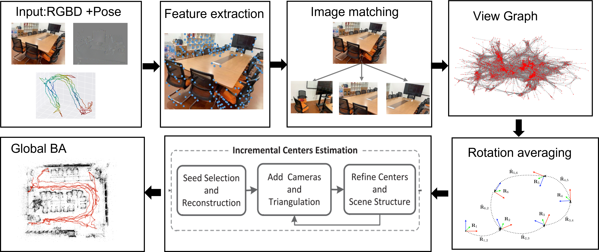

# PRGBD-hybrid-SfM

## PRGBD-hybrid-SfM 
A visual mapping framework developed based on iPhone RGB images, TOF information, and Arkit pose data.This framework is developed on the basis of  [colmap](https://github.com/colmap/colmap). 


### reference
[1]Cui H, Gao X, Shen S, et al. HSfM: Hybrid structure-from-motion[C]//Proceedings of the IEEE conference on computer vision and pattern recognition. 2017: 1212-1221.


[2]Chatterjee A, Govindu V M. Efficient and robust large-scale rotation averaging[C]//Proceedings of the IEEE International Conference on Computer Vision. 2013: 521-528.
## Build
<a name="build"></a>
Dependencies from the default Ubuntu repositories:
```bash
sudo apt-get install \
    git \
    cmake \
    ninja-build \
    build-essential \
    libboost-program-options-dev \
    libboost-filesystem-dev \
    libboost-graph-dev \
    libboost-system-dev \
    libboost-test-dev \
    libeigen3-dev \
    libflann-dev \
    libfreeimage-dev \
    libmetis-dev \
    libgoogle-glog-dev \
    libgflags-dev \
    libsqlite3-dev \
    libglew-dev \
    qtbase5-dev \
    libqt5opengl5-dev \
    libcgal-dev \
    libceres-dev
```
```bash
mkdir build
cd build
cmake .. 
make
```
After compiling, the colmap executable will be generated. You can check all available commands by running help. 
```bash 
./build/src/exe/colmap help
```
## Run
We have provided IOS data collection software in another repository.
You can refer to:[ios-data-collector](https://github.com/KunruiHuang/ios-data-collector). 

### data preparation 
Due to the fact that data collection is usually done through video, there are a large number of redundant images in the data,  we first use the pose transformation of VIO  Pose to extract keyframes from the original data.

There are two main parameters that control the extraction of keyframes:
* Keyframe.rot_change( unit degree) for relative pose changes between adjacent frames.
* Keyframe.pos_change(unit m) for relative position changes between adjacent frames. 

Run keyframe extractor 
```bash
./build/src/exe/colmap keyframe --project_path=./config/keyframe.ini
```
## sample_data
Test data can be downloaded here:[Test Data Link](https://github.com/colmap/colmap). 
### Feature extraction 
We use the same method to extract SIFT feature points from the image, and simultaneously store the depth information of each feature point in the database.

Run feature extraction 
```bash
./build/src/exe/colmap feature_extractor --project_path=./config/feature_extractor.ini
```

### Feature matching 
By default, we use the vocabulary tree for feature matching. 


```bash 
./build/src/exe/colmap vocab_tree_matcher --project_path=./config/vocab_tree_matcher.ini
```

### Hybrid mapping 
The hybrid mapper is mainly used to complete the reconstruction with rgb, depth and VIO attitude information simultaneously.  
```bash
./build/src/exe/colmap hybrid_mapper --project_path=./config/hybrid_mapper.ini
```


